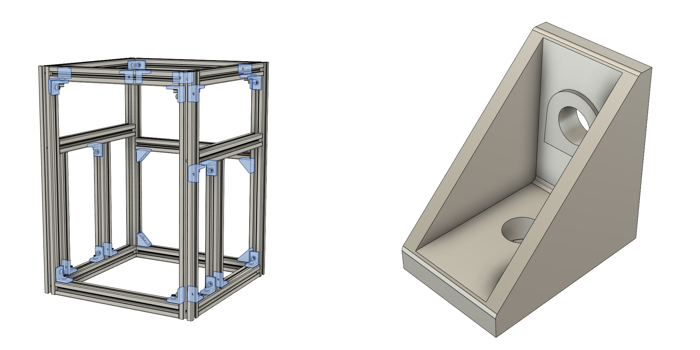
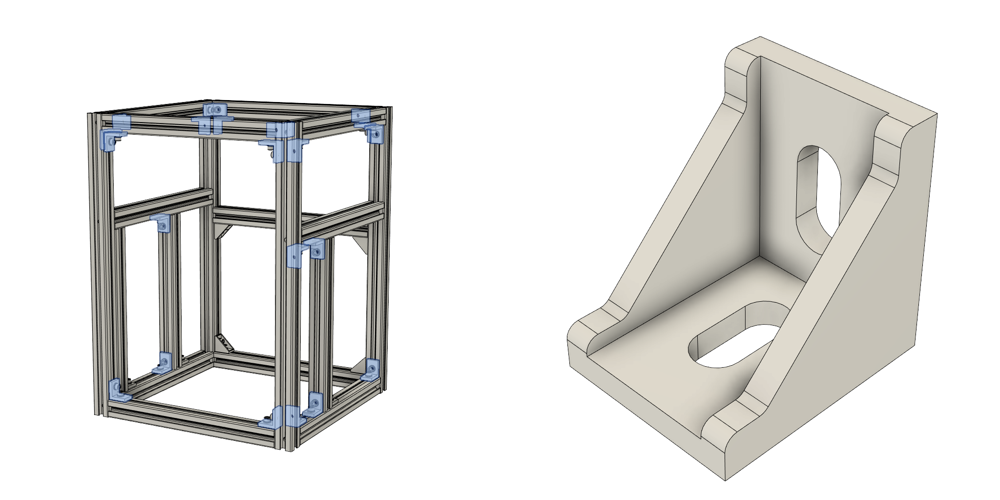
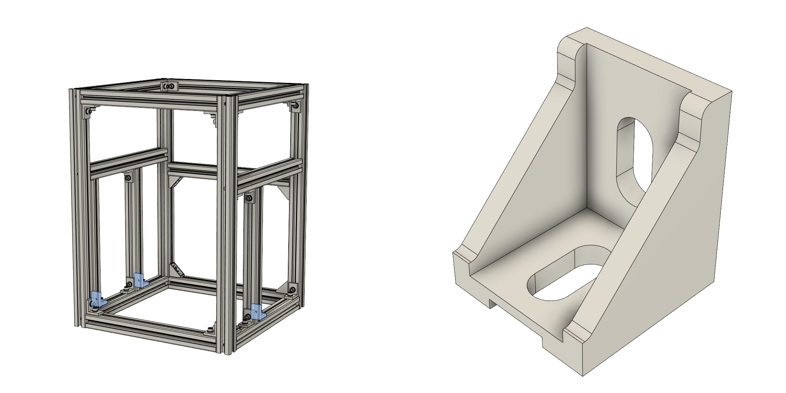
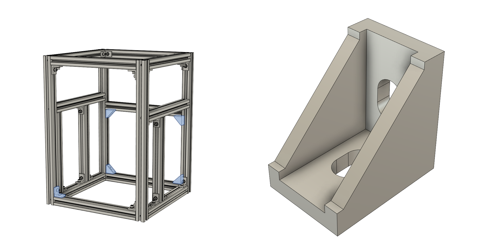

#### Depending on the type of brackets that you have, for SnakeOil frame you may need to use up to three different types

##### By default, SnakeOil uses:
- 29pcs HBLFSN6 type brackets

##### But if you don't have access to misumi brackets then you can use some others with these dimensions:
- 21pcs "normal" meaning rather no limitation on width and length. You can use the ones like in the picture. (dimensions 35x35x28) 

- 3pcs "30mm long", meaning rather no limitation on width but the length can be max 30mm. 
You can use the same brackets as above, you just need to cut or sand off a 5mm (dimensions 30x35x28) 

- 5pcs "20mm wide", meaning rather no limitation on length but the width can be max 20mm. 
You can use the same type of brackets as above but this time the version for 2020 profiles instead of 3030. (dimensions 28x28x20) 

