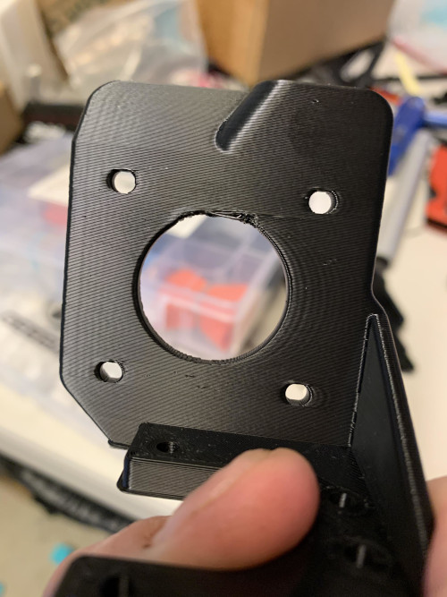
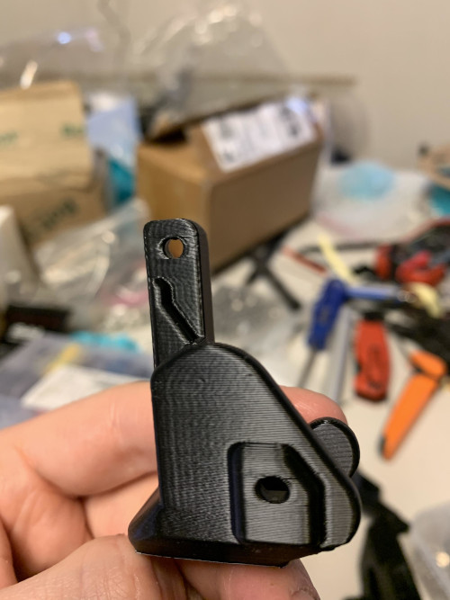
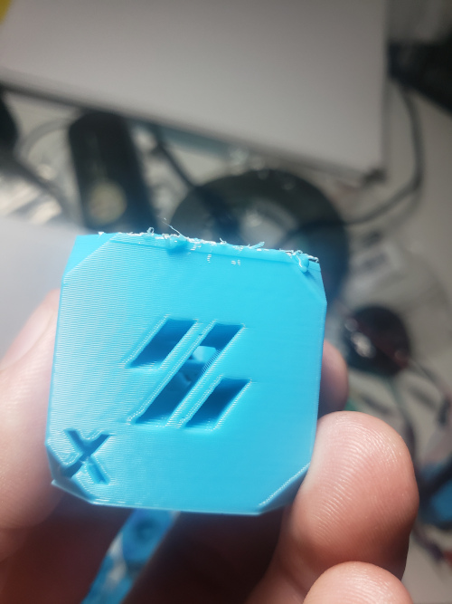
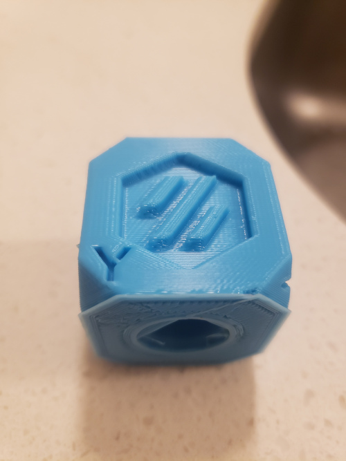
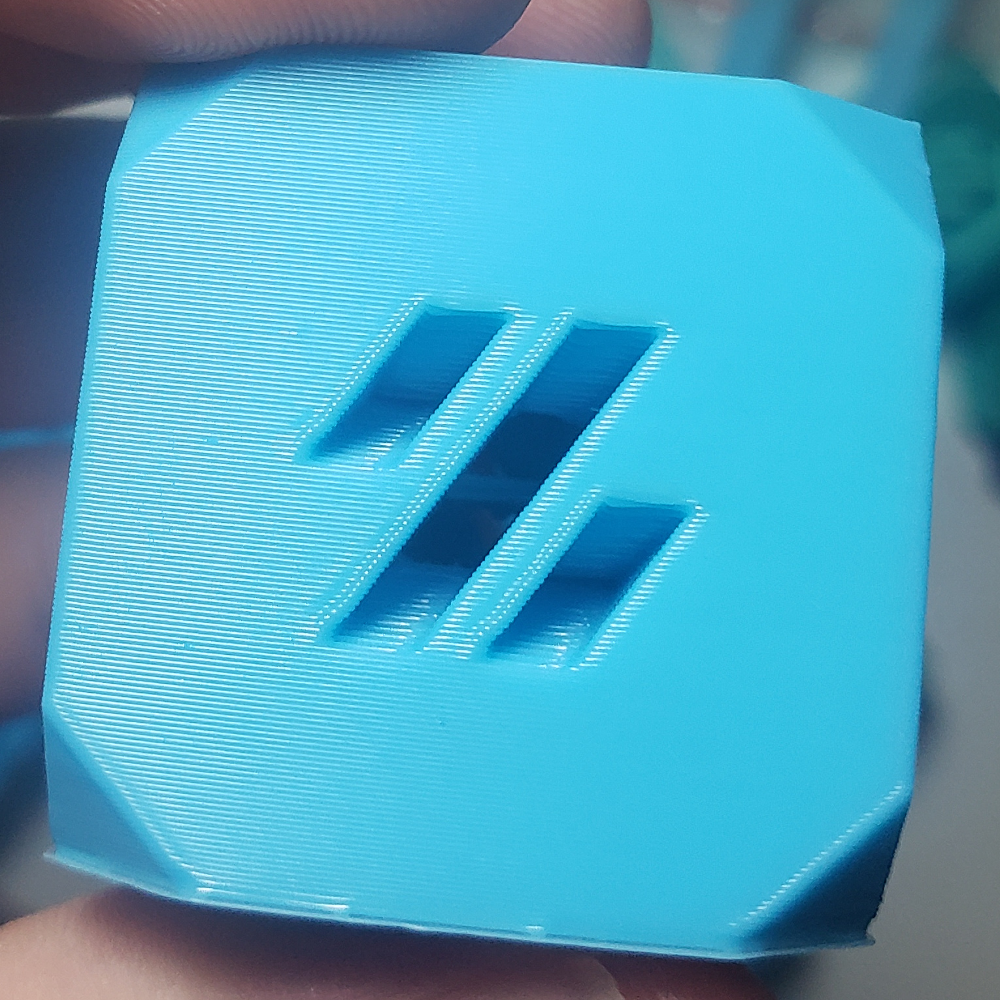
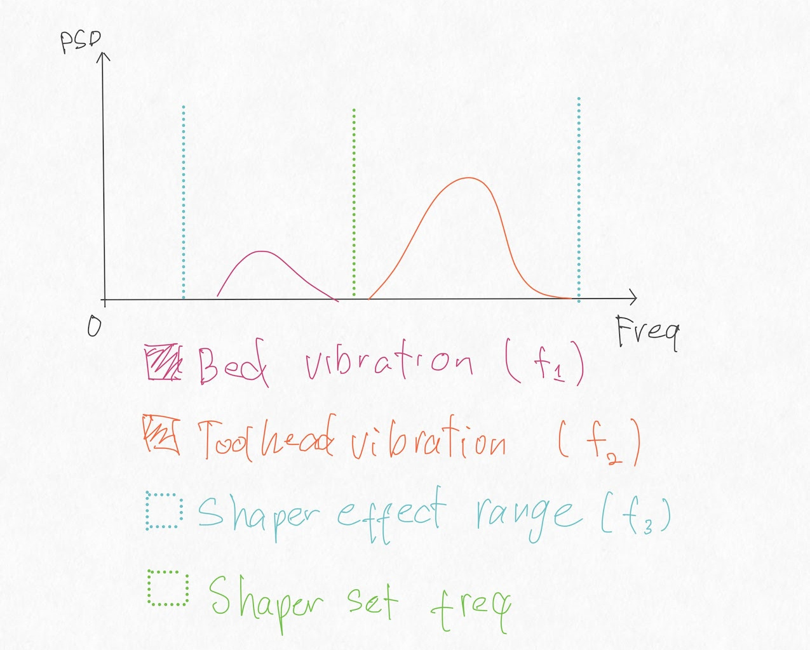
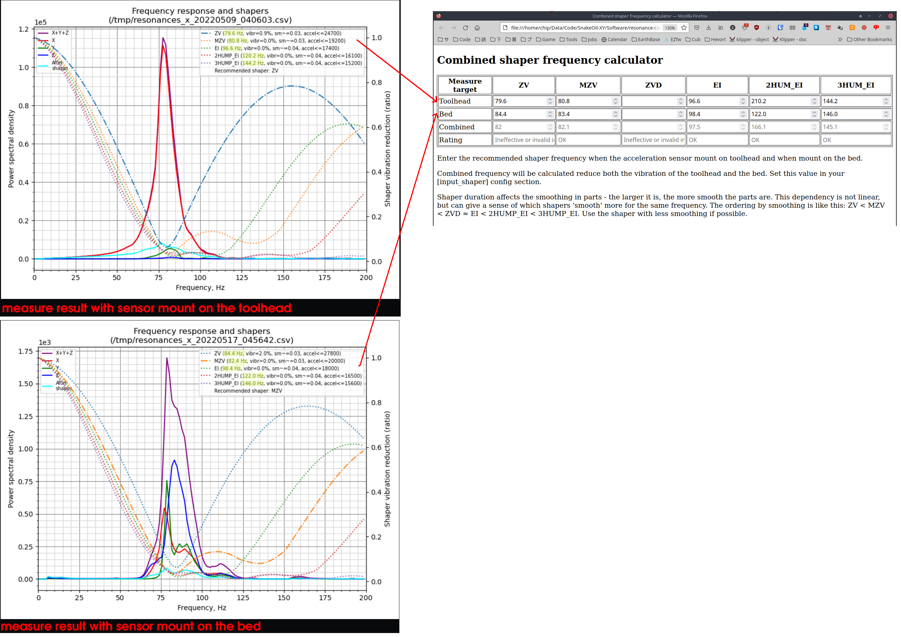

# Advance resonance tuning

## 1. Introduction

As reported by some of our members, even with an inputshaper enabled, a ringing pattern is present on printed parts(check images bellow). I did some research and with the help of our members, we found a solution to this problem.

## 2. Source of the problem

The acceleration sensor measures vibration of the toolhead, and applies shaper to reduce the vibration but assumes that the bed is rock solid (not affected by the toolhead or the printer vibrations).
Many things can falsify those tests: if your printer is placed on an unstable surface, has soft feet, the bed is able to vibrate or move or like in our case, the heavy bed is held by belts and they can stretch/shrink. The vibrations caused by the moving of the bed is, in our case, causing the ringing in the parts.

## 3. Solution

To eliminate the ringing, we need to measure vibrations of both the toolhead and the bed, then force the inputshaper to reduce the vibrations of both the bed and the toolhead. There are 2 methods to do this : <code>Use Klipper's calibrate_shaper with multy inputs</code> OR <code>manually calculate the shaper frequency</code>

※The image bellow is the Voron cube printed with 200mm/s outer wall after tuning with the second method.

## 4. Calculate the shaper frequency

### 4.1. Method 1 : Use Klipper's calibrate_shaper with multy inputs

- Make sure there are no <code>.csv</code> files left from previous calibration in <code>/tmp</code> directory. (tip : run <code>rm /tmp/\*.csv</code> to remove the old files if needed)
- Measure vibrations with the ADXL345 sensor mount on the toolhead. This step will generate 2 csv files (/tmp/resonances_x_yyyymmdd.csv and /tmp/resonances_y_yyyymmdd.csv)
- Measure the vibrations but with the ADXL345 sensor mount on the bed. This step will also generate 2 more csv files (/tmp/resonances_x_yyyymmdd.csv and /tmp/resonances_y_yyyymmdd.csv)
- Now you will have 4 csv files in <code>/tmp</code> directory,run the following commands, klipper will calculate the shaper frequency based on all 4 csv files we generated in the previous steps.

<pre>~/klipper/scripts/calibrate_shaper.py /tmp/resonances_x_*.csv -o /tmp/shaper_calibrate_x.png
~/klipper/scripts/calibrate_shaper.py /tmp/resonances_y_*.csv -o /tmp/shaper_calibrate_y.png
  </pre>

- Set the shaper frequency and shaper type as the above commands result.

### 4.2. Method 2 : Manually calculate the shaper frequency(if the above method does not work)

Each shaper has an effective range, all vibrations in that range will be reduced to a certain level. We measure the vibrations of the toolhead and the bed, then set a value that works for both. The only drawback to this method is that shapers with wide effective range like EI2 and EI3 will have lower recommended max accel value compared to other shaper.

- Make sure there are no <code>.csv</code> files left from previous calibration in <code>/tmp</code> directory. (tip : run <code>rm /tmp/\*.csv</code> to remove the old files if needed)
- Measure vibrations with the ADXL345 sensor mount on the toolhead. This step will generate 2 csv files (/tmp/resonances_x_yyyymmdd.csv and /tmp/resonances_y_yyyymmdd.csv)
- Run the following commands to generate the graph of the toolhead vibration
<pre>~/klipper/scripts/calibrate_shaper.py /tmp/resonances_x_*.csv -o /tmp/shaper_calibrate_toolhead_x.png
~/klipper/scripts/calibrate_shaper.py /tmp/resonances_y_*.csv -o /tmp/shaper_calibrate_toolhead_y.png
  </pre>
- Remove the previous step data with the command bellow
<pre>rm /tmp/*.csv</pre>
- Measure the vibrations but with the ADXL345 sensor mount on the bed. This step will generate 2 csv files (/tmp/resonances_x_yyyymmdd.csv and /tmp/resonances_y_yyyymmdd.csv)
- Run the following commands to generate the graph of the bed vibration
<pre>~/klipper/scripts/calibrate_shaper.py /tmp/resonances_x_*.csv -o /tmp/shaper_calibrate_bed_x.png
~/klipper/scripts/calibrate_shaper.py /tmp/resonances_y_*.csv -o /tmp/shaper_calibrate_bed_y.png
  </pre>

- Download the [calc tool html file here](https://raw.githubusercontent.com/SnakeOilXY/SnakeOil-XY/master/Software/resonance-caculator/index.html) and open it with your web browser by double clicking the htlm file.
- Enter the measured results(from the generated graphs) into the calc tool and it will output the combined frequency that works for both the toolhead and the bed.
- Set that value in your printer config.

※Example for the X axis
