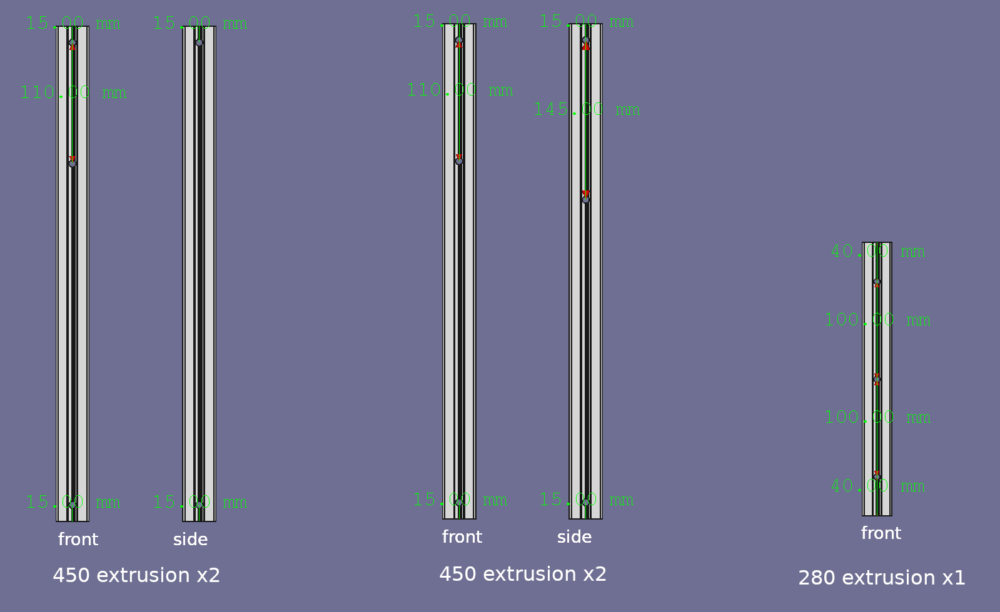

# Aluminum bed plate and extrusion drilling location

## Aluminum bed plate

- The printer bed plate can be 190x190mm or 190x193mm to match the size of Prusa mini bed. The reason I choose the Prusa bed size is because PEI sheet for Prusa mini are easy to source and available in many type of surface.
- Compare to 190x190, 190x193mm bed have some extra space for bolts that we can use to align the PEI sheet on the bed.
- The hole diameter for m3 bolt need to be 3.2mm-3.6mm(bolt body) and 6.0mm-6.5mm(bolt cap). The small play between the bolt and it's hole will prevent the bed from bowing due thermal expansion.

## Extrusion

- 4 vertical 450mm 3030 extrusions and a 280mm 3030 extrusion need to be drilled for allen key access
- The hole diameter for 450mm extrusion is about 6.5mm (for m8 allen key access)
- The hole diameter for 280mm extrusion is about 5.5mm (for m6 allen key access)
- For 250mm^3 machine, the drill spacing is 160mm(instead of 110mm) and 195mm(instead of 145mm).

