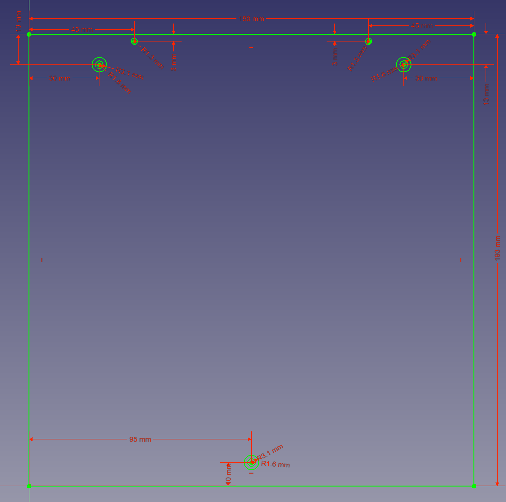
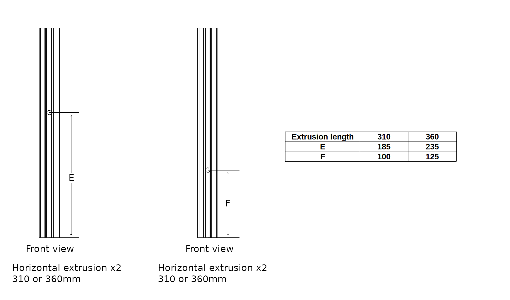

# Aluminum bed plate and extrusion drilling location

## Aluminum bed plate

- The hole diameter for m3 bolt hand bolt head need to be at least the same or slighty bigger than the size in the drawing (except the d2.6mm holes that need to be tapped). Those hole side are caculated to encouter thermal expansions of the bed plate.

### 180mm machine

### 250mm machine

## Extrusion

- The hole diameter for 450/500/550mm extrusion is about 6.5~7.5mm (for m8 allen key access)
- The hole diameter for 280/330mm extrusion is about 5.5~7.5mm (for m6 allen key access)
- All extrusions will need to be M8 tapped, except 1x 280mm(180 machine) and 1x 330mm(250 machine)

