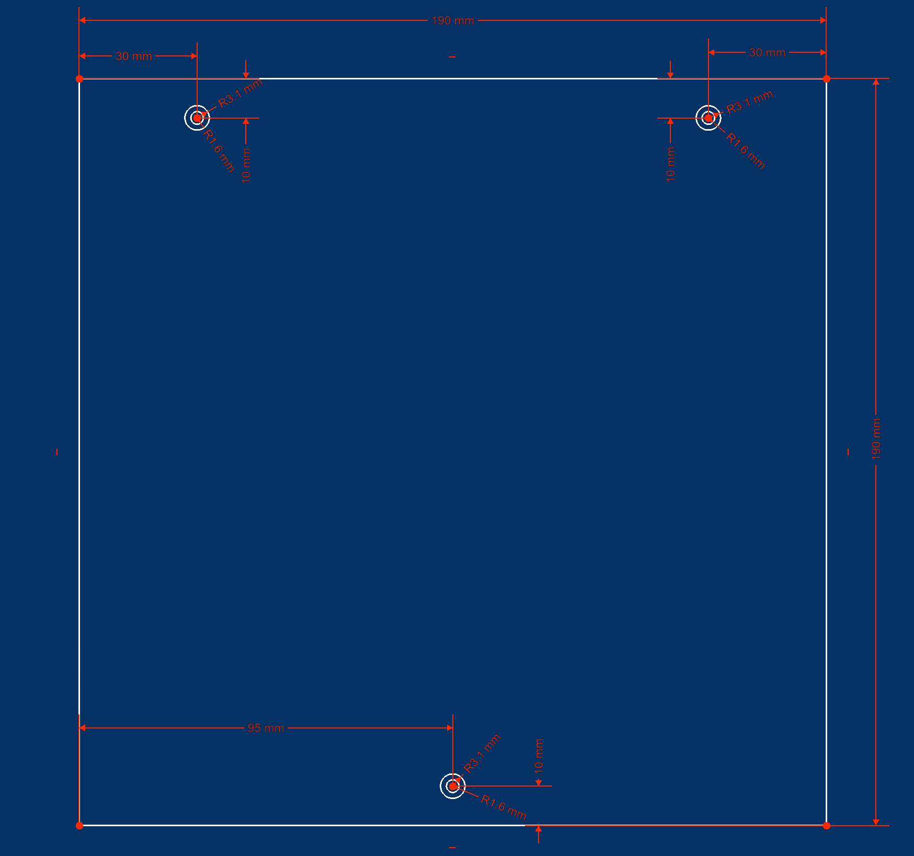

# Aluminum bed plate

- The printer bed plate can be 190x190mm or 190x193mm to match the size of Prusa mini bed. The reason I choose the Prusa bed side because PEI sheet for Prusa mini are easy to source and available in many type of surface.
- Compare to 190x190, 190x193mm bed have some extra space for bolts that we can use to align the PEI sheet on the bed.

