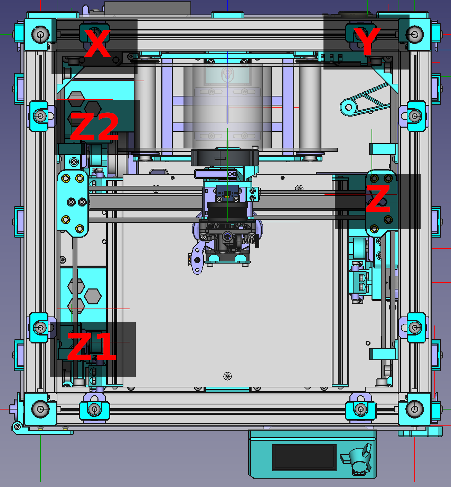

# Pre-flight check

## 0. Firmware config

- This config check is based on config of my machine(180mm). You will need to edit the config based on how you do the wiring and your hardwares. If not sure, please ask in #build-help or #firmware discord channel.
- sample config available at [sample config directory](https://github.com/ChipCE/SnakeOil-XY/tree/master/Firmware/sample-configs/Klipper/BTT_octopus_pro_Chip)

### 0.1. SONOFF config

If you are using sonoff wifi to control the power of the machine, there will be some extra step needed.

- Flash custom tasmota firmware following [tasmota firmware document](https://tasmota.github.io/docs/Getting-Started/)
- After installed custom fw, connect the sonoff module to wifi and remember it's IP address(Some other configs lie password, device name can also editable via SONOFF web interface).
- Enable firmware option26 by visit the following address using web browser <code>http://YOUR_SON_OFF_IP_HERE/cm?cmnd=SetOption26 ON</code>
- Add the following config into moonraker.conf
<pre>[power PSU]
type: tasmota
locked_while_printing: True
restart_klipper_when_powered: True
restart_delay: 5
address:YOUR_SONOF_IP_HERE
password:YOUR_SONOFF_PASSWORD</pre>
- After adding the config and restart moonraker/refresh webUI, you will have new section to turn the printer ON/OFF from fluidd/mainsail interface.

## 1. Endstop

- Move the toolhead to center position and execute <code>QUERY_ENDSTOPS</code> command. Both X and Y endstop status should be OPEN.
- Move the toolhead to touch X limit switch and execute <code>QUERY_ENDSTOPS</code> command. X endstop status should be TRIGGERED.
- Move the toolhead to touch Y limit switch and execute <code>QUERY_ENDSTOPS</code> command. Y endstop status should be TRIGGERED.
- Follow klipper guide to check bltouch. [Bltouch guide](https://www.klipper3d.org/BLTouch.html)

## 2. Motors

### 2.1. Motor location

- Run <code>STEPPER_BUZZ STEPPER=stepper_name_here</code> to verify the config and motor position are matched.

### 2.2 Motor direction and homing

- Move the toolhead to the center position, the bed to the middle position.
- Execute <code>G28 X</code>, the toolhead should move to the right, if not edit the <code>dir_pin</code> config and try again.
- Execute <code>G28 Y</code>, the toolhead should move to the back, if not edit the <code>dir_pin</code> config and try again.
- After homing X and Y worked, execute <code>G28</code> to home all axis. The homing order should be: Bed move down 10mm, home X, home Y, home Z

## 4. Bed position

- To make sure the bed leveling accuracy and does not take too much tries to level, the center of the bed should be well configured.
- Use some kind of marker or tape to make the center position of the bed. The bed center point is 85mm from the left edge of the bed and 85 mm from the front.
- Home all axis and execute <code>G1 X85 Y85</code>, if the nozzle is not directly above the center point of the bed, you will need to adjust the <code>position_endstop</code> of stepper_x and stepper_y section.

### 5. Bed mesh and leveling

- Home all axis
- Verify if <code>Z_TILT_ADJUST</code> works.
- Verify if <code>BED_MESH_CALIBRATE</code> works.

## 5. Pid

- Do pid tuning for hotend and the bed. If you have fan under the bed, make sure to turn it on before do the bed pid tuning. If the fan is too strong, you will have to lower the fan max speed.

## 6. Slicer config

- My config using custom start gcode that parse the print area and filament type variable for "bed-mesh on print a rea only" and filament specified setting. Check <code>SET_FILAMENT_PROFILE</code> macro for more info.

### 6.1. Cura slicer gcode setting

<pre>#start gcode
START_PRINT EXTRUDER_TEMP={material_print_temperature_layer_0} BED_TEMP={material_bed_temperature_layer_0} AREA_START=%MINX%,%MINY% AREA_END=%MAXX%,%MAXY% FILAMENT_TYPE={material_type}

#end gcode
END_PRINT</pre>

- Cura slicer will also need custom post processing script. The script is available in Slicer/Cura/scripts/ directory. You will need to copy this file to scripts folder of cura (Cura "help" menu -> "Show configuration folder") and enable it in post-processing setting.
- Sample profiles also available at Slicer/Cura/profile/ directory

### 6.2. Prusa slicer setting

- Parsing filament type via gcode is not supported in prusa slicer yet, you will have to set it manually in filament config of prusa slicer and disable <code>SET_FILAMENT_PROFILE</code> in start macro config

<pre>#start gcode
START_PRINT EXTRUDER_TEMP=[first_layer_temperature] BED_TEMP=[first_layer_bed_temperature] AREA_START={first_layer_print_min[0]},{first_layer_print_min[1]} AREA_END={first_layer_print_max[0]},{first_layer_print_max[1]}

#end gcode
END_PRINT

#after layer change gcode
DISPLAY_GCODE_PROGRESS TOTAL_LAYER=[total_layer_count] CURRENT_LAYER={layer_num+1} PROGRESS=0 REMAIN=00:00
</pre>
