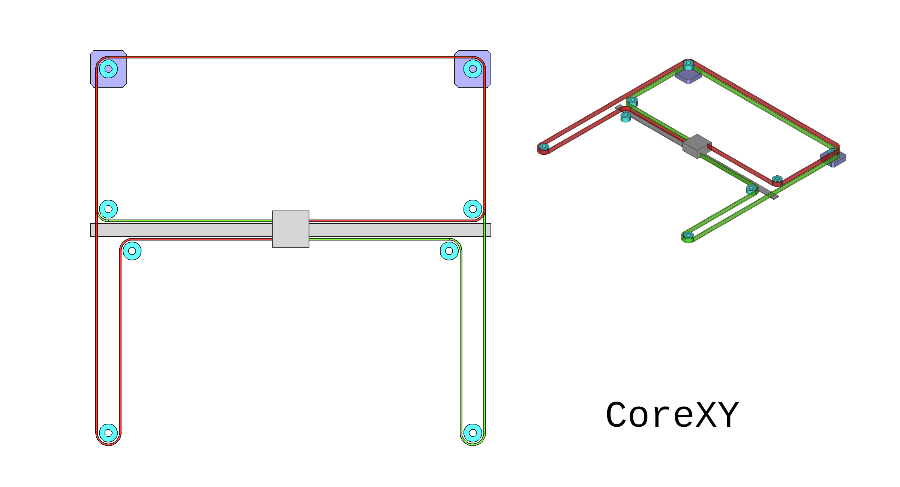
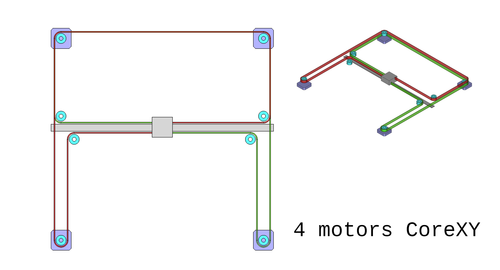
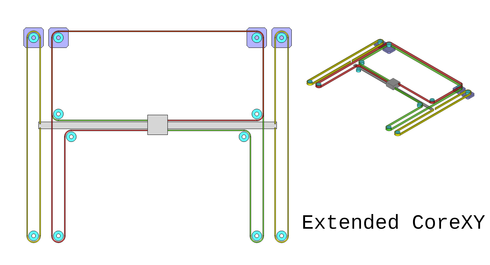
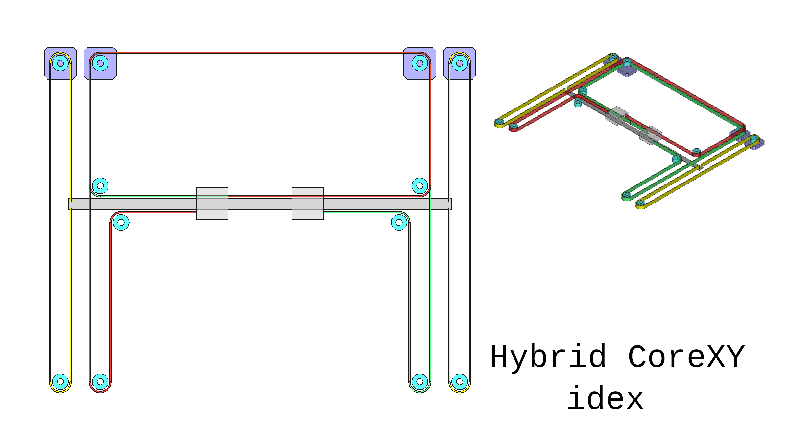

# Introduction to extended-coreXY
 In the next beta3 release, we will add support/upgrade options for <code>SnakeOil IDEX</code> (using hybrid_coreXY kinematic) and <code>SnakeOil Large Format</code> (using extended_coreXY kinematic).  
 Extended Corexy(name might be changed when merged into klipper main branch) is a mix of traditional coreXY and hybrid coreXY.
Before explained what is extended coreXY and it's benefit, let's check the traditional coreXY and 4 motors coreXY (aslo called AWD coreXY or 4WD coreXY) concept and their benefits.

### Traditional Corexy

- With stationary motors, we have less moving mass compared to bed-slinger machine and result in have faster max speed and higher max acceleration without losing print quality.
- It's hard to keep the same performance when scale up the machine because increase of the gantry mass and longer belt length.

### 4 motors coreXY

- By adding 2 more motor, we have more torque and shorter motor-to-toolhead belt path. 
- This setup is effective, simple, and easy to adapt to current core system.  
- But we cannot set independent speed/acceleration for X and Y axis(yet) the whole system performance need to be lower to match Y axis performance(the same as traditional coreXY).

### Extended coreXY

- The ideal of extended coreXY is instead of add power to both X and Y axis, we add 2 motors to support the heavy Y axis only. And with less load on AB motors, hopefully we also will have some boost on X axis too.  
- Compare to 4 motors coreXY, extended coreXY will require more parts and modify to the current system to add 2 extra motors. Tuning belt tension for Y axis also need more effort than tuning for other coreXY setup.
- An other benefit of extended coreXY is the system can be easily switched to IDEX  hybrid coreXY by just adding 1 more toolhead as the image bellow.

## Current firmware support state

 Support for extended coreXY kinematic is not merged into mainline Klipper yet, but we have working code and over 100 hours of test print without problem. There is plan to submit PR for this kinematic in the future. For now, you can find the working code in [our github](https://github.com/ChipCE/klipper/blob/master/klippy/kinematics/extended_corexy.py)  

 To install, copy <code>extended_corexy.py</code> to your Klipper <code>klippy/kinematics/</code> directory and adding config as the example bellow.  

 If you have any questions or suggestions, feel free to ask on our [SnakeOilXY discord](https://discord.gg/WZVP2HuAag)

<pre>
[printer]
kinematics: extended_coreXY
max_velocity: 500 ; max feedrate 30K
max_accel: 20000
max_accel_to_decel: 20000
max_z_velocity: 10 ; max feedrate 600
max_z_accel: 1000
square_corner_velocity: 5
#home_y_axis_with_b_rail : False

[stepper_a]
step_pin: PG4
dir_pin: PC1
enable_pin: !PA0
microsteps: 32
rotation_distance: 40
full_steps_per_rotation:200
endstop_pin:!PG15
position_endstop: 3
position_min: 0
position_max: 250
homing_speed: 100
homing_retract_dist: 10.0

[stepper_b]
step_pin: PF9
dir_pin: PF10
enable_pin: !PG2
microsteps: 32
rotation_distance: 40
full_steps_per_rotation:200
endstop_pin: !PG11
position_endstop: 200
position_min: -15
position_max: 200
homing_speed: 100
homing_retract_dist: 10.0

[stepper_c]
step_pin: PE2
dir_pin: !PE3
enable_pin: !PD4
microsteps: 32
rotation_distance: 40
full_steps_per_rotation:200
endstop_pin: !PG10
position_endstop: 200
position_min: -15
position_max: 200
homing_speed: 100
homing_retract_dist: 10.0

[stepper_c1]
step_pin: PE6
dir_pin: PA14
enable_pin: !PE0
microsteps: 32
rotation_distance: 40
full_steps_per_rotation:200
endstop_pin: !PG9

</pre>