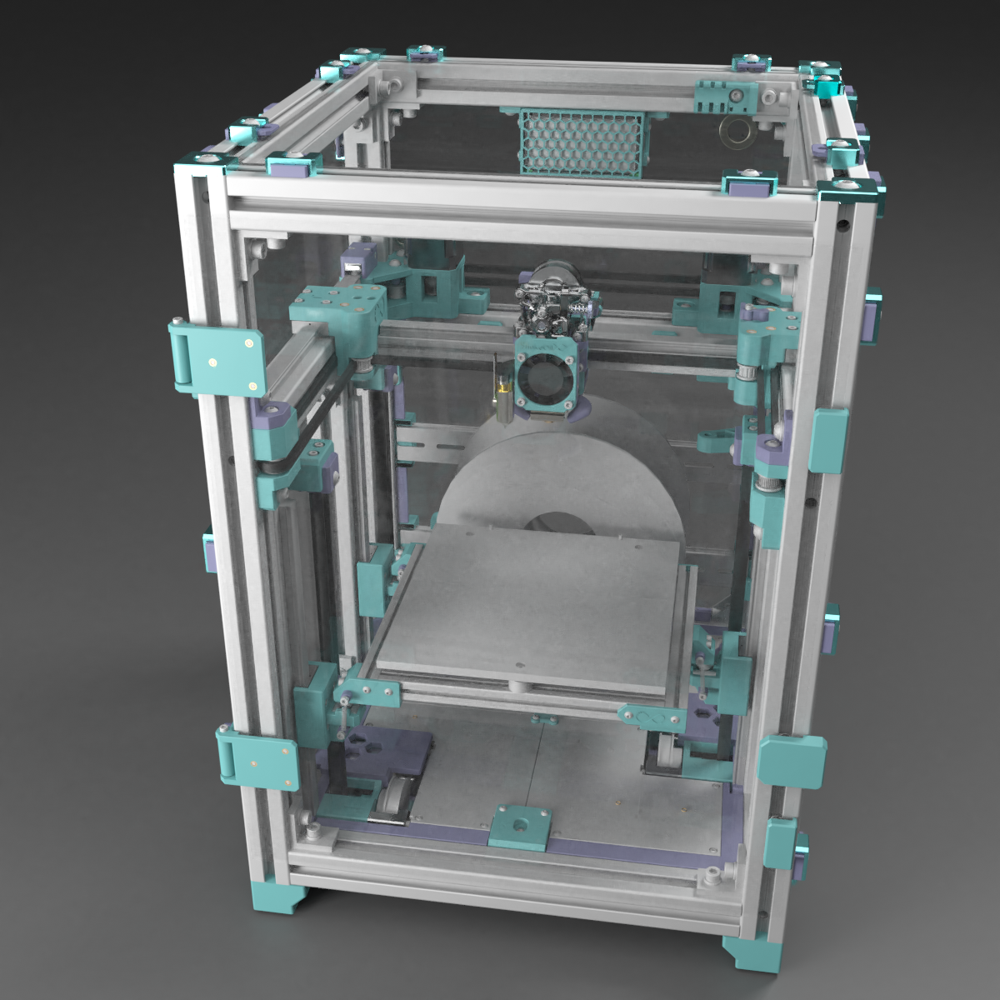
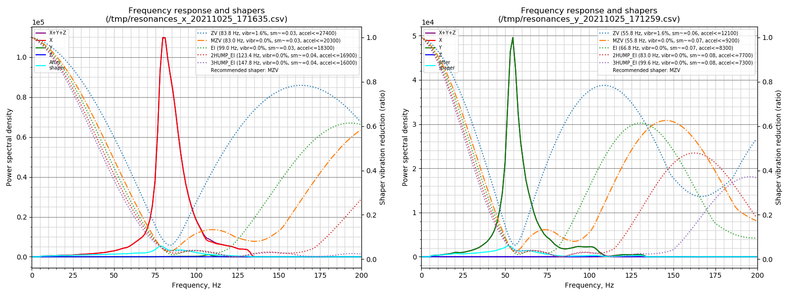

# SnakeOil XY

Stable hi-speed, small size fully-featured affordable CoreXY 3D printer. Inspired by [HevORT](https://miragec79.github.io/HevORT/), [Voron](https://vorondesign.com/), [Annex Engineering](https://github.com/Annex-Engineering) and [EVA2](https://main.eva-3d.page/) design.

## Features

<table>
    <thead>
        <tr>
            <th>Feature</th>
            <th>Credit/Inspiration by/Description</th>
        </tr>
    </thead>
    <tbody>
        <tr>
            <td>3 Point bed leveling</td>
            <td>HevORT, Wobble ring</td>
        </tr>
        <tr>
            <td>Belted Z</td>
            <td>Lulz bot, Voron</td>
        </tr>
        <tr>
            <td>Din mounter</td>
            <td>Voron</td>
        </tr>
        <tr>
            <td>Cross belt corexy belt path</td>
            <td>HevORT</td>
        </tr>
        <tr>
            <td>Eva compatible toolhead</td>
            <td>EVA</td>
        </tr>
        <tr>
            <td>Filament spoll in side chamber</td>
            <td>-</td>
        </tr>
        <tr>
            <td>Quick release panels</td>
            <td>Added on beta2 release</td>
        </tr>
        <tr>
            <td>Built-in chamber air filter</td>
            <td>Added on beta1 release</td>
        </tr>
        <tr>
            <td>Auto build sheet detect and profile loader</td>
            <td>Work in progress</td>
        </tr>
        <tr>
            <td>AIO filament runout + jam detector + width sensor</td>
            <td>Work in progress</td>
        </tr>
        <tr>
            <td>Modular sensor add-on system</td>
            <td>Work in progress</td>
        </tr>
        <tr>
            <td>Probe(bed mesh) on print area only</td>
            <td>Added on beta2 using klipper macro</td>
        </tr>
        <tr>
            <td>Screwless belt mounter</td>
            <td>VzBot</td>
        </tr>
        <tr>
            <td>Bed fan</td>
            <td>Qholia</td>
        </tr>
    </tbody>
</table>

## Input shaper test result (beta2 1515 gantry with Sherpa mini extruder)

## Demo videos

<table>
    <thead>
        <tr>
            <th></th>
            <th align="center">Bed coupling</th>
            <th align="center">SpeedBoatRace</th>
            <th align="center">Slow benchy</th>
        </tr>
    </thead>
    <tbody>
        <tr>
            <td>Video</td>
            <td align="center"></td>
            <td align="center"></td>
            <td align="center"></td>
        </tr>
        <tr>
            <td>Hardware version</td>
            <td align="center">beta1</td>
            <td align="center">beta2</td>
            <td align="center">beta2</td>
        </tr>
    </tbody>
</table>

## BOM

## **_SnakeOil-XY currently has 2 versions_**

<code>Both machines are practicaly identical, only difference is the build volume. </code>

### 180x180x180mm build volume (Standard)

- [1803mm BOM](./Doc/BOM/bom-180.md)

### 250x240x230mm build volume (Large)

- [2503mm BOM](./Doc/BOM/bom-250.md)

## Manual

[>>> Click here <<<](./Doc/Manual/README.md)

## Firmware

[>>> Click here <<<](./Firmware/README.md)

## Copyright Notice

- [Sherpa mini extruder](https://github.com/Annex-Engineering/Sherpa_Mini-Extruder) is an original work of [Annex Engineering](https://github.com/Annex-Engineering), modified parts using their source code/design files are re-released under [ANNEX Engineering License](https://github.com/Annex-Engineering/ANNEX-Engineering-License-Agreement/blob/main/LICENSE.md).
- [EVA2](https://github.com/EVA-3D/eva-main) is an original work of [EVA-3D](https://github.com/EVA-3D), modified parts using their source code/design files are re-released under [GNU General Public License v3.0](https://github.com/EVA-3D/eva-main/blob/main/LICENSE)
- This printer design(SnakeOil XY), it's document and software are released under [GNU General Public License v3.0](https://github.com/ChipCE/SnakeOil-XY/blob/master/LICENSE)
