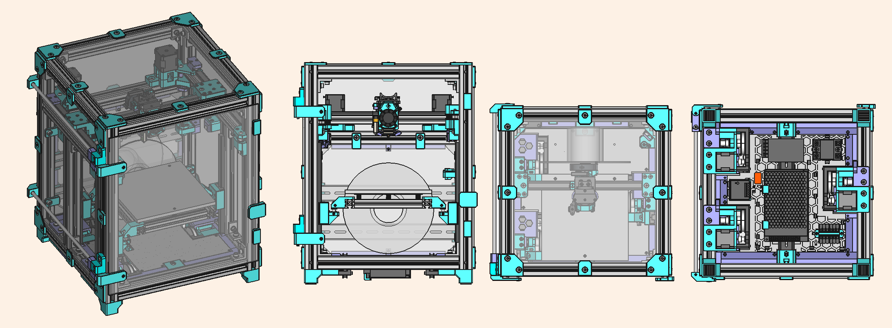

# SnakeOil XY

Small size, affordable and fast CoreXY 3D printer. Inspired by [HevORT](https://miragec79.github.io/HevORT/), [Voron](https://vorondesign.com/) and [Annex Engineering](https://github.com/Annex-Engineering) design.  
This project was started as [HevORT lite](https://github.com/ChipCE/HevORT-lite), a trimdown design based on [HevORT corexy](https://miragec79.github.io/HevORT/) 3D printer. In the process of trying to make the printer easier to enclosure, parts easier to print without support, I ended up with redesigned all of the parts.

The first release ETA is scheduled on the end of August 2021.

Any suggestions, feature requests, questions are welcomed, feel free to contact me via [Twitter](https://twitter.com/ChipMaple) or [Join discord group](https://discord.gg/WZVP2HuAag)

## About this project

- Small printer that stable and can print fast ([Check the previous version speed benchy run](https://www.youtube.com/watch?v=qDmU6JHQ-gc)).
- Use off-the-shell parts
- Does not need special tool to make the parts
- Affordable price

## Development progress

- [x] New XY axis
- [ ] Foot and panel mount
- [ ] Flex sheet auto detect
- [x] Belted Z and 3 points leveling
- [x] EVA2 toolhead system compatible
- [ ] Brush nozzle cleaning
- [ ] Circular air filter
- [x] Filament spool inside machine chamber
- [x] Standard 3030 T-slot frame support
- [ ] Carbon fiber X gantry
- [ ] AIO filament runout + width sensor
- [x] Move XY motors inside chamber for easier enclosure. (XY motors can still be isolated from chamber with custom cut panel)

## Feature

| Feature                                    | Credit/Inspiration by/Description |
| ------------------------------------------ | --------------------------------- |
| 3 Point bed leveling                       | HevORT, Wobble ring               |
| Belted Z                                   | Voron                             |
| Cross belt corexy belt path                | HevORT                            |
| Eva compatible toolhead                    | EVA                               |
| Filament spoll in side chamber             | Annex Engineering                 |
| Auto build sheet detect and profile loader | Work in progress                  |
| AIO filament runout + width sensor         | Work in progress                  |

## Q/A

- n/a

## BOM

### Frame and rails

<pre>3030 310mm x11
3030 280mm x3
3030 450mm x4

2020 290mm x1
2020 190mm x2
2020 150mm x2

MGN12H 250mm x6</pre>

### Idler, pulley and belt

<pre>20T 6mm Pulley x2
16T 6mm Pulley x3
80T 6mm Pulley x3

20T 9mm Pulley x3

20T 6mm Smooth Idler x10
20T 6mm Tooth Idler x2

20T 9mm Tooth idler x3

Close loop  188-2GT-6 RF belt x3
2GT 6mm belt ~3m
2GT 9mm belt ~2m</pre>
